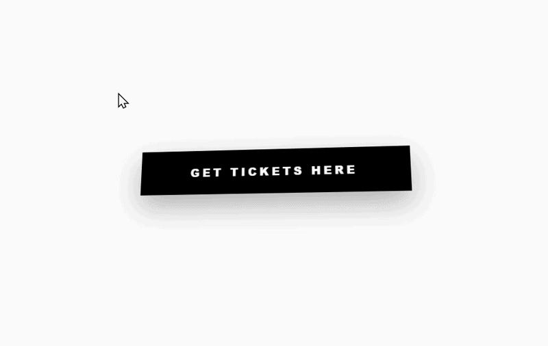

## **Copying the Sublime "buy tickets" Button**
I saw the website of the band Sublime and really liked the motion of the "Buy Tickets Now" button. https://www.megustafest.com/copy-of-home


I decided to recreate it. I used ChatGPT and got nowhere. Gemini and I initially looked at the code of the website and did get some hints, but the model said it was familiar with the effect and provided a replica example, but that wasn't that close. I went back and forth with it refining it, tweaked a few numbers manually and looking at the original code, then eventually landed on the example in the video. Check out the demo and then see how to do it below. 

[](https://kevanmacgee.github.io/sublime-button-example/index.html)

( !!! Note: everything written after this paragraph was written by Gemini.)



## **Magnetic 3D "Staring" Button**

This project provides a high-fidelity replica of the "Magnetic 3D Tilt" button interaction found on modern premium web platforms (like Wix Studio). Unlike standard hover effects, this interaction tracks the mouse **globally** across the entire viewport, creating a "compass" or "staring" effect that aggressively draws user attention.

------

## **The Effect: Global 3D Magnetism**

The button behaves like a physical slab suspended in 3D space. It doesn't just react when the mouse is over it; it is aware of the cursor's position anywhere on the page.

- **Global Tracking:** The button tilts its surface toward the cursor regardless of where the mouse is on the screen.
- **3D See-Saw Physics:** It utilizes CSS 3D transforms (`rotateX`, `rotateY`) and `perspective` to create realistic depth.
- **Dynamic Translation:** The button "slides" slightly toward the cursor, giving it a magnetic, floating sensation.
- **Inertia & Weight:** A tuned `ease-out` transition creates a sense of physical mass, preventing the motion from feeling "robotic" or jittery.

------

## **How It Works**

### **1. 3D Scene Setup**

To enable 3D rotation, the button is placed inside a container with the CSS `perspective` property. This defines the "distance" between the user and the z-plane. A lower value (e.g., `600px`) makes the 3D distortion look more extreme, while a higher value (e.g., `1200px`) makes it subtle.

CSS

```
.scene {
  perspective: 1000px; /* Essential for 3D depth */
}

.button {
  transform-style: preserve-3d; /* Allows child elements to live in 3D space */
  transition: transform 0.15s ease-out; /* Adds 'weight' to the motion */
}
```

### **2. Coordinate Normalization**

The JavaScript listens for `mousemove` events on the `window`. It calculates the distance between the center of the button and the mouse cursor. These values are then "normalized" into a range between **-1 and 1** based on the window size.

JavaScript

```
window.addEventListener('mousemove', (e) => {
  const rect = el.getBoundingClientRect();
  const centerX = rect.left + rect.width / 2;
  const centerY = rect.top + rect.height / 2;

  // Normalizes the mouse position relative to center
  const x = (e.clientX - centerX) / (window.innerWidth / 2);
  const y = (e.clientY - centerY) / (window.innerHeight / 2);
});
```

### **3. The Math (Mapping)**

The normalized values are multiplied by a degree limit.

- **Horizontal mouse movement (x)** maps to **Rotation Y** (swinging the sides).
- **Vertical mouse movement (y)** maps to **Rotation X** (swinging the top/bottom).
- **Translation** is added to make the button "float" toward the cursor.

JavaScript

```
const d = 30; // Max tilt in degrees
const rX = y * -d; 
const rY = x * d;
const tX = x * 15; // Max 15px slide
const tY = y * 15;

el.style.transform = `rotateX(${rX}deg) rotateY(${rY}deg) translateX(${tX}px) translateY(${tY}px)`;
```

### **4. Physical Smoothing**

The "see-saw" feel is achieved through the CSS `transition`. By using `ease-out`, the button accelerates toward the mouse position and slows down as it reaches the target. This creates a tiny "lag" that the human eye perceives as physical weight.

------

## **Technical Implementation**

- **Language:** HTML5, CSS3, Vanilla JavaScript.
- **Zero Dependencies:** No external libraries (like jQuery or GSAP) are required.
- **Performance:** Utilizes `will-change: transform` to ensure the browser offloads the animation to the GPU, keeping the frame rate at a smooth 60fps.
